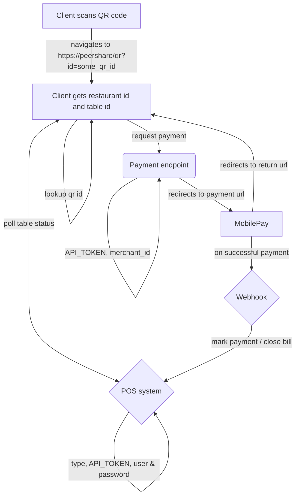

# PeerShare "Tabs" Architecture

The following is a high-level sketch of the peershare tabs architecture.
PeerShare tabs rely on some centralized computing that interface with Point-of-sale Systems.

We should use client devices as much as possible in the process and rely on cloud functions when possible.

## Overview

In the following graph a diamond shape is used to indicate cloud functions while the rounded corners in `Payment endpoint` indicate webserver backend.
Normal rectangles indicate code that is run somewhere not controlled by us.

## Client

PeerShare app is programmed in Svelte.js and deployed to Netlify.

Most stuff runs in client, but there is server side rendering happening.

## Payment Endpoint

This endpoint should run on the peershare webserver backend (if it is possible for us to handle multiple merchants this way??)

It should communicate with MobilePay and respond with a payment url when paying via mobile pay.

## Webhook

The webhook should be a cloud function and is invoked by MobilePay when user completes a payment.

Webhook closes / marks as payed - and communicates with POS in specific restaurant.

## POS

The POS (point of sale) system communicates with the relevant pos system at a restaurant and is a cloud function that is invoked by the client, when app is in use.

cloud function should cache response and only query pos every set interval (don't overwhelm pos if many users are online at the same time, asking for the same things).

# Other details

## QR Codes

All QR codes should be links on the form `peershare.app/qr?type=x&version=x&id=x`. 
A QR code has three nescessary parameters, i.e. `type`, `version`, and `id`.

- __Type__ indicates context about use case, e.g `restaurant`.
- __Version__ allow for supporting old and new versions of QR codes of the same type. 
- __ID__ is the unique identifyer for the QR code.

Based on this the client app may perform zero or more lookups and decide what to do based on this.
